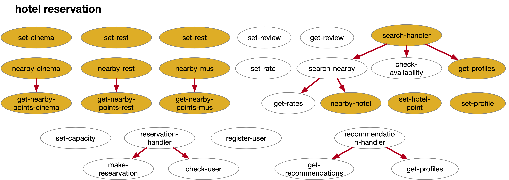

### nearby-rest

```bash
curl localhost:8080/function/nearby-rest -d '{"hotel_id":"h1347234"}'
```

### nearby-mus

```bash
curl localhost:8080/function/nearby-mus -d '{"hotel_id":"h1347234"}'
```

### nearby-cinema

```bash
curl localhost:8080/function/nearby-cinema -d '{"hotel_id":"h1347234"}'
```

### get-nearby-points-rest

```bash
curl localhost:8080/function/get-nearby-points-rest -d '{"latitude":32.7157, "longitude":117.1611}'
```

### get-nearby-points-mus

```bash
curl localhost:8080/function/get-nearby-points-mus -d '{"latitude":32.7157, "longitude":117.1611}'
```

### get-nearby-points-cinema

```bash
curl localhost:8080/function/get-nearby-points-cinema -d '{"latitude":32.7157, "longitude":117.1611}'
```

### nearby-hotel

```bash
curl localhost:8080/function/nearby-hotel -d '{"latitude":32.7157, "longitude":117.1611}'
```

### get-profiles

```bash
curl localhost:8080/function/get-profiles -d '{"hotel_ids":["h1347232","h1347233","h1347234"]}'
```

### set-cinema

```bash
curl localhost:8080/function/set-cinema -d '{"cinema_id":"c66778","latitude":33.1456,"longitude":115.7421,"cinema_name":"NorthCin","cinema_type":"HD"}'
```

```bash
curl localhost:8080/function/set-cinema -d '{"cinema_id":"c66779","latitude":34.795,"longitude":116.9102,"cinema_name":"KKK house","cinema_type":"XScreen"}'
```

```bash
curl localhost:8080/function/set-cinema -d '{"cinema_id":"c66780","latitude":30.56,"longitude":119.278,"cinema_name":"LastDays","cinema_type":"HD"}'
```

```bash
curl localhost:8080/function/set-cinema -d '{"cinema_id":"c66782","latitude":39.795,"longitude":112.9102,"cinema_name":"KKK house","cinema_type":"XScreen"}'
```

```bash
curl localhost:8080/function/set-cinema -d '{"cinema_id":"c66781","latitude":31.441,"longitude":115.236,"cinema_name":"LastDays","cinema_type":"HD"}'
```

### set-hotel-point

```bash
curl localhost:8080/function/set-hotel-point -d '{"id":"h1347234","latitude":33.565,"longitude":117.641}'
```

```bash
curl localhost:8080/function/set-hotel-point -d '{"id":"h1347233","latitude":34.897,"longitude":119.625}'
```

```bash
curl localhost:8080/function/set-hotel-point -d '{"id":"h1347232","latitude":31.424,"longitude":113.771}'
```

```bash
curl localhost:8080/function/set-hotel-point -d '{"id":"h1347235","latitude":30.123,"longitude":114.733}'
```

```bash
curl localhost:8080/function/set-hotel-point -d '{"id":"h1347237","latitude":39.565,"longitude":115.131}'
```

### set-mus

```bash
curl localhost:8080/function/set-mus -d '{"museum_id":"m73415", "latitude":33.117,"longitude":118.233,"museum_name":"National Museum", "museum_type":"history"}'
```

```bash
curl localhost:8080/function/set-mus -d '{"museum_id":"m73416", "latitude":31.137,"longitude":114.223,"museum_name":"Art Museum", "museum_type":"art"}'
```

```bash
curl localhost:8080/function/set-mus -d '{"museum_id":"m73417", "latitude":35.298,"longitude":113.713,"museum_name":"History Museum", "museum_type":"history"}'
```

```bash
curl localhost:8080/function/set-mus -d '{"museum_id":"m73418", "latitude":39.215,"longitude":120.788,"museum_name":"Science Museum", "museum_type":"science"}'
```

```bash
curl localhost:8080/function/set-mus -d '{"museum_id":"m73419", "latitude":34.464,"longitude":115.579,"museum_name":"Natural Museum", "museum_type":"nature"}'
```

### set-profile

```bash
curl localhost:8080/function/set-profile -d '{"hotel_id":"h1347234","name":"Hilton","phone_number":"800-789-2345","description":"No description","address":{"street_number":"3590","street_name":"Chestnut Street","city":"Philadelphia","state":"PA","country":"USA","postal_code":"19104","latitude":33.565,"longitude":117.641},"images":[]}'
```

```bash
curl localhost:8080/function/set-profile -d '{"hotel_id":"h1347235","name":"Youth Hotel","phone_number":"734-888-2345","description":"No description","address":{"street_number":"4107","street_name":"Spruce Street","city":"Philadelphia","state":"PA","country":"USA","postal_code":"19104","latitude":34.897,"longitude":119.625},"images":[]}'
```

```bash
curl localhost:8080/function/set-profile -d '{"hotel_id":"h1347237","name":"Hope Hotel","phone_number":"245-189-7768","description":"No description","address":{"street_number":"4107","street_name":"Spruce Street","city":"Philadelphia","state":"PA","country":"USA","postal_code":"19104","latitude":35.298,"longitude":113.713},"images":[]}'
```

```bash
curl localhost:8080/function/set-profile -d '{"hotel_id":"h1347232","name":"Campus Hotel","phone_number":"122-761-9981","description":"No description","address":{"street_number":"4107","street_name":"Spruce Street","city":"Philadelphia","state":"PA","country":"USA","postal_code":"19104","latitude":39.215,"longitude":120.788},"images":[]}'
```

```bash
curl localhost:8080/function/set-profile -d '{"hotel_id":"h1347233","name":"In&Out Hotel","phone_number":"771-761-9981","description":"No description","address":{"street_number":"4107","street_name":"Spruce Street","city":"Philadelphia","state":"PA","country":"USA","postal_code":"19104","latitude":34.464,"longitude":115.579},"images":[]}'
```

### set-rest

```bash
curl localhost:8080/function/set-rest -d '{"restaurant_id":"r1537242","latitude":33.112,"longitude":115.744,"restaurant_name":"abc","rating":4,"restaurant_type":"fast food"}'
```

```bash
curl localhost:8080/function/set-rest -d '{"restaurant_id":"r1537244","latitude":36.112,"longitude":111.143,"restaurant_name":"def","rating":3,"restaurant_type":"fast food"}'
```

```bash
curl localhost:8080/function/set-rest -d '{"restaurant_id":"r1537245","latitude":35.971,"longitude":117.617,"restaurant_name":"terakawa","rating":4,"restaurant_type":"japanese food"}'
```

```bash
curl localhost:8080/function/set-rest -d '{"restaurant_id":"r1537247","latitude":39.235,"longitude":114.871,"restaurant_name":"sankee","rating":4,"restaurant_type":"chinese food"}'
```

```bash
curl localhost:8080/function/set-rest -d '{"restaurant_id":"r1537243","latitude":32.679,"longitude":110.221,"restaurant_name":"apple bee","rating":5,"restaurant_type":"western food"}'
```

### search-handler

```bash
curl localhost:8080/function/search-handler -d '{"latitude":32.7157,"longitude":117.1611,"in_date":"2024-09-01","out_date":"2024-09-05"}'
```

### recommendation-handler

```bash
curl localhost:8081/function/recommendation-handler -d '{"require":"price","latitude":32.113,"longitude":116.211}'
```

### reservation-handler

```bash
curl localhost:8081/function/reservation-handler -d '{"customer_name":"Yuxuan Zhang","username":"zyuxuan","password":"123456","hotel_id":"h1347232","in_date":"2024-09-01","out_date":"2024-09-05","room_number":5}'
```

### search-nearby

```bash
curl localhost:8081/function/search-nearby -d '{"latitude":32.7157,"longitude":117.1611,"in_date":"2024-09-01","out_date":"2024-09-01"}'
```

### check-availability

```bash
curl localhost:8081/function/check-availability -d '{"customer_name":"Yuxuan Zhang","hotel_id":["h1347232","h1347233"],"in_date":"2024-09-01","out_date":"2024-09-05","room_number":60}'
```

### check-user

```bash
curl localhost:8081/function/check-user -d '{"username":"zyuxuan","password":"123456"}'
```

```bash
curl localhost:8081/function/check-user -d '{"username":"sga001","password":"123456"}'
```

### get-rates

```bash
curl localhost:8081/function/get-rates -d '{"hotel_ids":["h1347234","h1347233","h1347232"],"in_date":"2025-05-17","out_date":"2025-05-19"}'
```

### set-rate

```bash
curl localhost:8081/function/set-rate -d '{"hotel_id":"h1347234","code":"","in_date":"2025-05-17","out_date":"2025-05-20","room_type":{"bookable_rate":149.5,"total_rate":149.5,"total_rate_inclusive":149.5,"code":"F143","currency":"USD","room_description":"double"}}'
```

```bash
curl localhost:8081/function/set-rate -d '{"hotel_id":"h1347233","code":"","in_date":"2025-05-19","out_date":"2025-05-21","room_type":{"bookable_rate":149.5,"total_rate":149.5,"total_rate_inclusive":149.5,"code":"F143","currency":"USD","room_description":"double"}}'
```

```bash
curl localhost:8081/function/set-rate -d '{"hotel_id":"h1347232","code":"","in_date":"2025-05-16","out_date":"2025-05-19","room_type":{"bookable_rate":149.5,"total_rate":149.5,"total_rate_inclusive":149.5,"code":"F143","currency":"USD","room_description":"double"}}'
```

### get-recommendation

```bash
curl localhost:8081/function/get-recommendation -d '{"require":"price","latitude":32.113,"longitude":116.211}'
```

```bash
curl localhost:8081/function/get-recommendation -d '{"require":"rate","latitude":32.113,"longitude":116.211}'
```

```bash
curl localhost:8081/function/get-recommendation -d '{"require":"dis","latitude":32.113,"longitude":116.211}'
```

### set-recommendation

```bash
curl localhost:8081/function/set-recommendation -d '{"hotel_id":"h1347232","latitude":31.424,"longitude":113.771,"rate":149.5,"price":200.5}'
```

```bash
curl localhost:8081/function/set-recommendation -d '{"hotel_id":"h1347234","latitude":34.712,"longitude":117.221,"rate":133.2,"price":183.5}'
```

### get-reviews

```bash
curl localhost:8081/function/get-reviews -d '{"hotel_id":"h1347234"}'
```

### set-review

```bash
curl localhost:8081/function/set-review -d '{"review_id":"rr1112","hotel_id":"h1347234","name":"Kate Zhang","rating":4,"description":"good hotel","image":{"url":"http://yahoo.com/abc.png","default":true}}'
```

```bash
curl localhost:8081/function/set-review -d '{"review_id":"rr1179","hotel_id":"h1347234","name":"Hikaru Naruto","rating":3,"description":"bad hotel","image":{"url":"http://yahoo.com/ccc.png","default":true}}'
```

```bash
curl localhost:8081/function/set-review -d '{"review_id":"rr1248","hotel_id":"h1347234","name":"Ken Tanaka","rating":3,"description":"bad hotel","image":{"url":"http://yahoo.com/1j2hc2H.png","default":true}}'
```

### make-reservation

```bash
curl localhost:8081/function/make-reservation -d '{"customer_name":"Yuxuan Zhang","hotel_id":"h1347232","in_date":"2024-09-01","out_date":"2024-09-05","room_number":50}'
```

```bash
curl localhost:8081/function/make-reservation -d '{"customer_name":"Yuxuan Zhang","hotel_id":"h1347232","in_date":"2024-09-01","out_date":"2024-09-05","room_number":60}'
```

### set-capacity

```bash
curl localhost:8081/function/set-capacity -d '{"hotel_id":"h1347232","capacity":100}'
```

```bash
curl localhost:8081/function/set-capacity -d '{"hotel_id":"h1347233","capacity":200}'
```

```bash
curl localhost:8081/function/set-capacity -d '{"hotel_id":"h1347234","capacity":150}'
```

### register-user

```bash
curl localhost:8081/function/register-user -d '{"username":"zyuxuan","password":"123456"}'
```

```bash
curl localhost:8081/function/register-user -d '{"username":"twenisch","password":"456789"}'
```

```bash
curl localhost:8081/function/register-user -d '{"username":"sga001","password":"001001"}'
```


