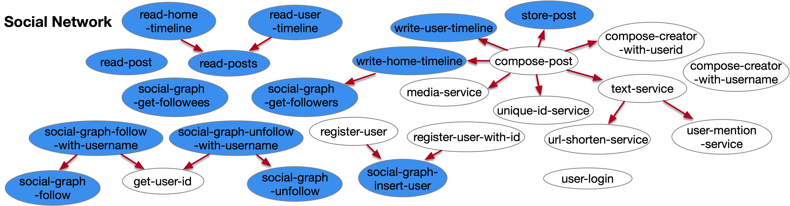

## The call graph of social network



## Rest API interface for each function

### UniqueIdService

```bash
curl 127.0.0.1:8081/function/unique-id-service -d '{"msg":""}'
```

### UrlShortenService

```bash
curl 127.0.0.1:8081/function/url-shorten-service -d '{"urls":["http://google.com","http://kate0115.net"]}'
```

### UserMentionService

```bash
curl 127.0.0.1:8081/function/user-mention-service -d '{"usernames":["Alice","Bob"]}'
```

### TextService

```bash
curl 127.0.0.1:8081/function/text-service -d '{"text":"Hey, this is @Yuxuan! Nice to meet you and welcome to my personal web: https://kate0115.net @twenisch"}'
```

### MediaService

```bash
curl 127.0.0.1:8081/function/media-service -d '{"media_id":[111,222],"media_type":["png","jpg"]}'
```

### RegisterUserWithId

```bash
curl 127.0.0.1:8081/function/register-user-with-id -d '{"first_name":"Tom","last_name":"Wenisch","username":"twenisch","password":"umichandgoogle","user_id":11028}'
```

```bash
curl 127.0.0.1:8080/function/register-user-with-id -d '{"first_name":"Todd","last_name":"Austin","username":"todda","password":"uwandupenn","user_id":11029}'
```

### RegisterUser

```bash
curl 127.0.0.1:8081/function/register-user -d '{"first_name":"Yuxuan","last_name":"Zhang","username":"zyuxuan","password":"umichandupenn"}'
```

### ComposeCreatorWithUsername

```bash
curl 127.0.0.1:8081/function/compose-creator-with-username -d '{"username":"zyuxuan"}'
```

### ComposeCreatorWithUserId

```bash
curl 127.0.0.1:8081/function/compose-creator-with-userid -d '{"user_id":11028,"username":"twenisch"}'
```

### GetUserId

```bash
curl 127.0.0.1:8081/function/get-user-id -d '{"username":"zyuxuan"}'
```

### UserLogin

```bash
curl 127.0.0.1:8081/function/user-login -d '{"username":"zyuxuan","password":"umichandupenn","secret":"idon'tknowwhatshouldbesecret"}'
```

### SocialGraphInsertUser

```bash
curl 127.0.0.1:8080/function/social-graph-insert-user -d '{"user_id":11028}'
```

```bash
curl 127.0.0.1:8080/function/social-graph-insert-user -d '{"user_id":11029}'
```

### SocialGraphFollow
  + I didn't check the replica of redis, but the DeathStarBench checked.

```bash
curl 127.0.0.1:8080/function/social-graph-follow -d '{"user_id":11028,"followee_id":11029}'
```

### SocialGraphUnfollow
  + I didn't check the replica of redis, but the DeathStarBench checked.

```bash
curl 127.0.0.1:8080/function/social-graph-unfollow -d '{"user_id":11028,"followee_id":11029}'
```

### SocialGraphFollowWithUsername

```bash
curl 127.0.0.1:8080/function/social-graph-follow-with-username -d '{"user_name":"twenisch","followee_name":"todda"}'
```

### SocialGraphUnfollowWithUsername

```bash
curl 127.0.0.1:8080/function/social-graph-unfollow-with-username -d '{"user_name":"twenisch","followee_name":"todda"}'
```

### SocialGraphGetFollowers
  + didn't test writing mongodb's data back to redis part

```bash
curl 127.0.0.1:8080/function/social-graph-get-followers -d '{"user_id":11029}'
```

### SocialGraphGetFollowees
  + didn't test writing mongodb's data back to redis part

```bash
curl 127.0.0.1:8080/function/social-graph-get-followees -d '{"user_id":11028}'
```

### StorePost

```bash
curl 127.0.0.1:8080/function/store-post -d '{"post_id":1723,"creator": {"user_id":11028,"username":"twenisch"},"req_id":7795,"text":"yesterday once more ","user_mentions": [],"media":[],"urls":[],"timestamp":12343249,"post_type":"POST"}'
```

```bash
curl 127.0.0.1:8080/function/store-post -d '{"post_id":1722,"creator": {"user_id":11029,"username":"todda"},"req_id":7798,"text":"Hey, this is @todda! Nice to meet you and welcome to my personal web: https://kate0115.net @tomwenisch ","user_mentions": [{"user_id":11029,"username":"todda"},{"user_id":11028,"username":"twenisch"}],"media":[],"urls":[],"timestamp":12343242,"post_type":"POST"}'
```

### ReadPost

```bash
curl 127.0.0.1:8080/function/read-post -d '{"post_id":1723}'
```

### ReadPosts

```bash
curl 127.0.0.1:8080/function/read-posts -d '{"post_ids":[1722,1723]}'
```

### WriteHomeTimeline
  + I was thinking of using redis pipe to insert data, but it doesn't work (for now)

```bash
curl 127.0.0.1:8080/function/write-home-timeline -d '{"post_id":1722,"user_id":11029,"timestamp":12343242,"user_mentions_id":[11028]}'
```

### ReadHomeTimeline

```bash
curl 127.0.0.1:8080/function/read-home-timeline -d '{"user_id":11028,"start":0,"stop":1}'
```

### WriteUserTimeline

```bash
curl 127.0.0.1:8080/function/write-user-timeline -d '{"post_id":1722,"user_id":11029,"timestamp":12343242}'
```

```bash
curl 127.0.0.1:8080/function/write-user-timeline -d '{"post_id":1723,"user_id":11028,"timestamp":12343249}'
```

### ReadUserTimeline

```bash
curl 127.0.0.1:8080/function/read-user-timeline -d '{"user_id":11029,"start":0,"stop":1}'
```

### ComposePost

```bash
curl 127.0.0.1:8081/function/compose-post -d '{"username":"twenisch","user_id":11028,"text":"Hey, this is @twenisch! Nice to meet you and welcome to my personal web: https://eecs.umich.edu/~twenisch @bobk ","media_ids":[],"media_types":[],"post_type":"POST"}"
```
